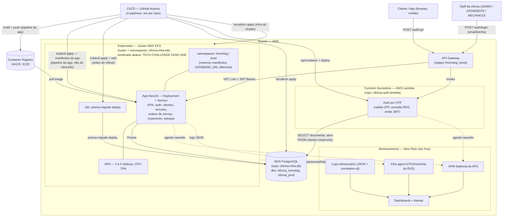

# Diagrama de Componentes — Oficina Mecânica (Fase 3)

> Cobre os 6 elementos exigidos pelo comunicado oficial da Fase 3: nuvem,
> APIs, banco de dados, Kubernetes, Function Serverless, ferramentas de
> monitoramento. Baseado nas decisões de `plan.md` (Fase 0) e nas RFCs/ADRs
> em `docs/rfc/` e `docs/adr/`.

## Notas

- **Nuvem**: AWS, conta única, separação lógica homolog/prod (namespaces no
  EKS, databases lógicos no RDS, aliases/stages na Lambda/Gateway) — ver
  ADR 0002.
- **APIs**: expostas pela app NestJS dentro do EKS; roteadas pelo API
  Gateway via VPC Link.
- **Banco de dados**: RDS PostgreSQL, único ponto de dados compartilhado
  entre app (via Prisma) e Lambda (consulta read-only direta) — ver
  RFC 0002 e RFC 0003.
- **Kubernetes**: EKS, com HPA já validado na Fase 2 — ver ADR 0003.
  Fronteira de responsabilidade: `oficina-infra-k8s` provisiona o cluster
  (rede, node groups, add-ons, namespaces, autoscaling da infra); o repo da
  app é dono dos manifestos que rodam dentro dele (`Deployment`, `Service`,
  `HPA`, `ConfigMap`, `Secret`, Job de migration) e do pipeline que os
  aplica — ver ADR 0001 e ADR 0005.
- **Function Serverless**: Lambda de autenticação por CPF, roda na mesma
  VPC do RDS.
- **Monitoramento**: New Relic cobrindo APM, infraestrutura, logs e
  dashboards — ver RFC 0004 e ADR 0004.
