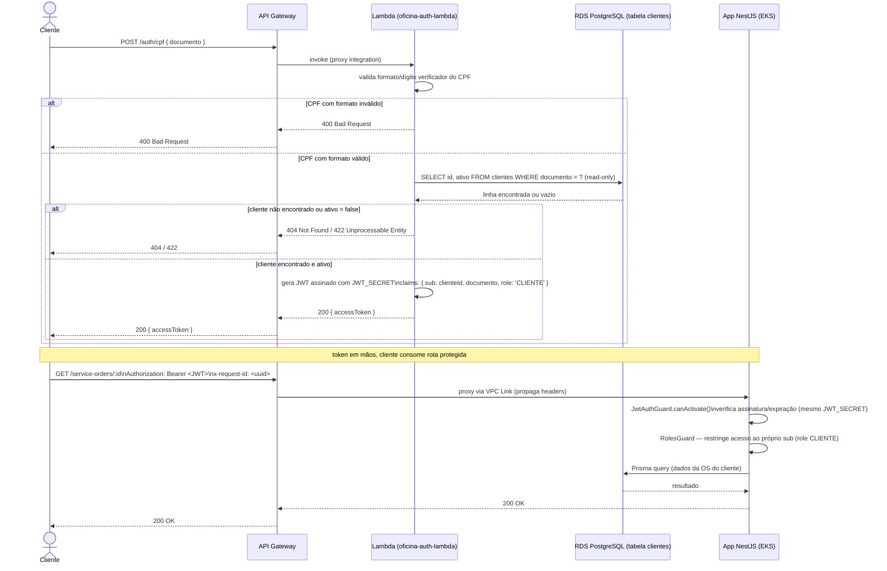

# Diagrama de Sequência — Autenticação por CPF

> Fluxo: cliente → API Gateway → Lambda → banco → JWT, seguido do uso do
> token numa rota protegida da app. Baseado na RFC 0003
> (`docs/rfc/0003-estrategia-autenticacao-cpf.md`) e no `JwtAuthGuard`
> (`src/modules/auth/guards/jwt-auth.guard.ts`).

## Notas

- A Lambda **nunca chama a API principal** para validar o CPF — acessa o
  RDS diretamente, read-only, restrito a `documento` e `ativo` (decisão da
  RFC 0003). Evita expor endpoint público/sem JWT na app só para esse
  propósito.
- O `JwtAuthGuard` da app não muda entre os dois tipos de ator (staff via
  email/senha, cliente via CPF) — só valida assinatura/expiração com o
  mesmo `JWT_SECRET`. Quem diferencia o ator é o campo `role`/`actorType`
  no payload, verificado pelo `RolesGuard`.
- `x-request-id` propagado do cliente (ou gerado no Gateway) até a Lambda e
  a app, para correlacionar logs no New Relic — ver ADR 0004.
