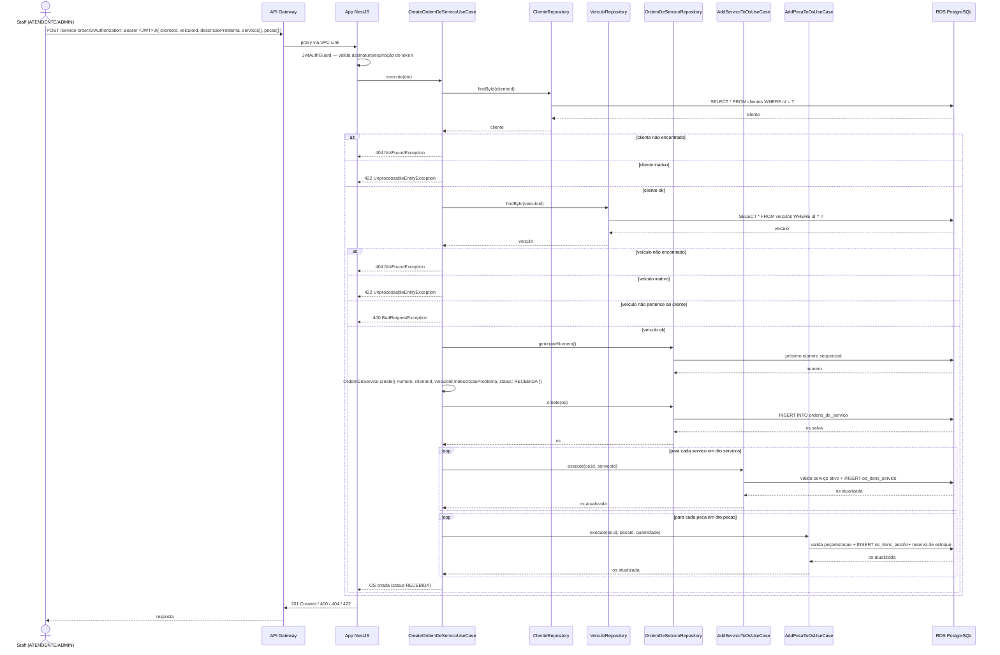

# Diagrama de Sequência — Abertura de Ordem de Serviço

> Baseado em `CreateOrdemDeServicoUseCase`
> (`src/modules/service-orders/application/use-cases/create-service-orders.usecase.ts`)
> e nos use cases auxiliares `AddServicoToOsUseCase` /
> `AddPecaToOsUseCase`. Rota: `POST /service-orders`, protegida pelo
> `JwtAuthGuard` global (staff autenticado, sem restrição de role
> específica nesse endpoint).

## Notas

- OS nasce sempre com status `RECEBIDA` (enum `StatusOS` do Prisma schema).
- Adicionar serviços/peças na abertura é opcional (`dto.servicos ?? []`,
  `dto.pecas ?? []`) — reaproveita os mesmos use cases usados para
  adicionar itens depois da criação.
- Validações de negócio (cliente/veículo ativos, veículo pertence ao
  cliente) ficam no use case, não no controller — mantém a regra fora da
  camada de apresentação (Clean Architecture já usada no projeto).
- `x-request-id` da requisição deve aparecer em todo log emitido durante
  esse fluxo (ver ADR 0004), inclusive em eventual `error` log se alguma
  validação falhar de forma inesperada.
