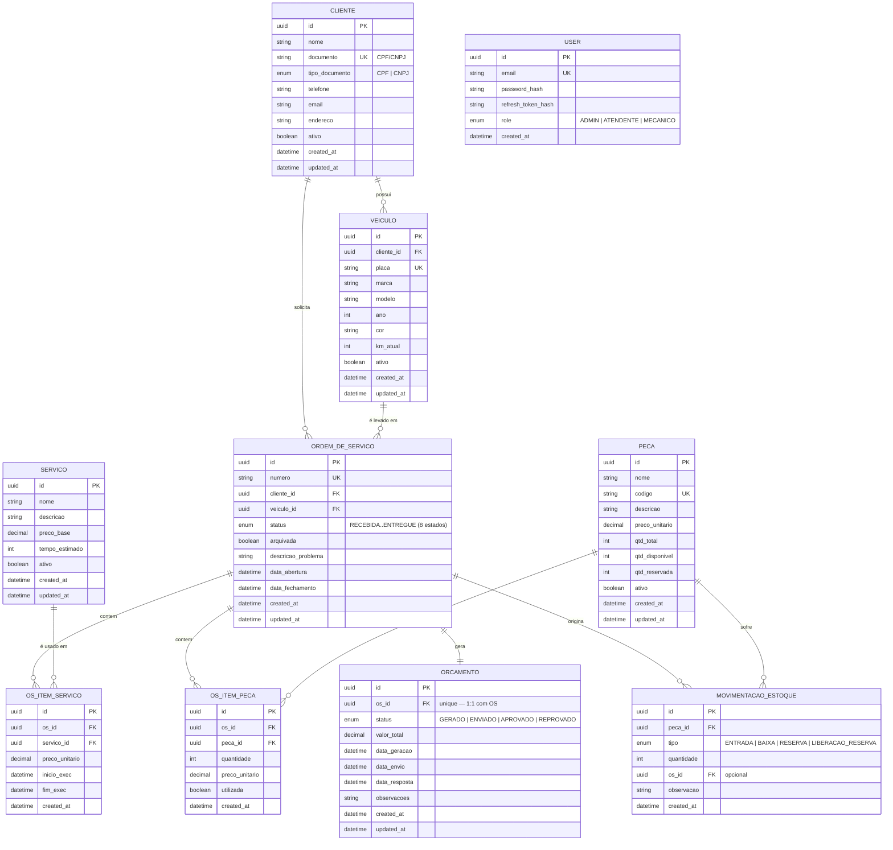

# Diagrama ER — Modelo Relacional

> Gerado a partir de `prisma/schema.prisma` (fonte da verdade). Este arquivo
> deve ser referenciado (ou copiado) em `oficina-infra-db` — o PDF exige
> "justificativa formal da escolha do banco + diagrama ER" nesse repo,
> já que é o dono do recurso de banco gerenciado (ver RFC 0002).

## Justificativa e relacionamentos

- **`clientes` 1:N `veiculos`**: um cliente pode ter vários veículos
  cadastrados; `veiculos.cliente_id` é obrigatório (todo veículo pertence a
  um cliente).
- **`clientes` 1:N `ordens_de_servico`** e **`veiculos` 1:N
  `ordens_de_servico`**: uma OS sempre referencia exatamente um cliente e
  um veículo (validado no `CreateOrdemDeServicoUseCase`: o veículo
  informado precisa pertencer ao cliente informado).
- **`ordens_de_servico` N:M `servicos`** via `os_itens_servico`: tabela
  associativa que guarda o preço praticado no momento da adição
  (`preco_unitario` congela o valor, independente de mudanças futuras em
  `servicos.preco_base`) e o intervalo de execução (`inicio_exec`/
  `fim_exec`), usado pelo módulo `relatorios` para calcular tempo médio por
  status.
- **`ordens_de_servico` N:M `pecas`** via `os_itens_peca`: mesma lógica de
  preço congelado, mais a flag `utilizada` (peça reservada vs.
  efetivamente consumida na OS).
- **`ordens_de_servico` 1:1 `orcamentos`**: `orcamentos.os_id` é `@unique`
  — cada OS gera no máximo um orçamento ativo.
- **`pecas` 1:N `movimentacoes_estoque`**: toda entrada/baixa/reserva/
  liberação de estoque é rastreada; `os_id` é opcional porque
  movimentações do tipo `ENTRADA` (reposição de estoque) não estão
  associadas a nenhuma OS.
- **`users` isolada**: tabela de autenticação do staff (`ADMIN`/
  `ATENDENTE`/`MECANICO`), sem FK para o restante do modelo — é
  intencionalmente desacoplada do domínio de negócio (ver RFC 0003: `User`
  é auth interno por email/senha; `Cliente` passa a autenticar via CPF pela
  Lambda, mas `Cliente` já existia como entidade de negócio, não como
  registro de autenticação).

## Por que RDS PostgreSQL (não migra motor)

Ver RFC 0002 (`docs/rfc/0002-banco-de-dados-gerenciado.md`) para a análise
completa de alternativas. Resumo: o modelo acima já é 100% relacional com
FKs, enums e `@unique` constraints usados ativamente pelas regras de
negócio (ex.: `veiculos.placa` único, `orcamentos.os_id` único para
garantir 1:1) — trocar de motor exigiria reescrever schema e migrations
sem nenhum ganho para o escopo do projeto. RDS PostgreSQL mantém o mesmo
motor usado via Prisma desde a Fase 2.
